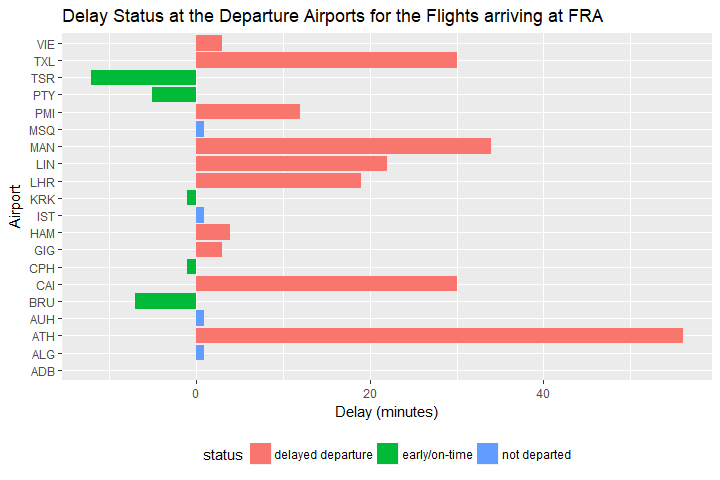

# LufthansaR
`r Sys.Date()`  


## Introduction to LufthansaR

`LufthansaR` is an API wrapper package for R. It enables programmers to access to [Lufthansa Open API](https://developer.lufthansa.com/docs) from R environment. 

This document introduces you to LufthansaR's basic set of tools, and show how to use them. Once you have installed the package, read `vignette("LufthansaR")` to learn more.

## Lufthansa Open API

To have access to Lufthansa Open API, one has to sign in to Mashery, Lufthansa's developer platform, and apply for a key. Please visit [here](https://developer.lufthansa.com/docs/API_basics/). Once you are registered, you will be given:

- a key and
- a secret

These two values can be exchanged for a _short-lived_ access token. A valid access token must be sent with every API request while accessing any Lufthansa's API. In other words, every Lufthansa API requires you to pass Oauth token when getting the data from it. 

## How to install LufthansaR

You can install `LufthansaR` development version from GitHub


```r
devtools::install_github("peter0083/LufthansaR")
```

CRAN version of the package will be scheduled to be added in the next version.

## Usage

You can load `LufthansaR` as follows.


```r
library(LufthansaR)
```

This will load the core `lufthansaR` functions. 


## How to deal with Lufthansa Open API credentials

You can store your client ID and secret in a `~/.Renviron` file. R loads this file as
a system variable in each new session. The package uses these variables to request
new keys if needed. The `.Renviron` file should contain the lines

```
LUFTHANSA_API_CLIENT_ID = 'xxxxxxxxxxxxxxxxxxxxxxxx'
LUFTHANSA_API_CLIENT_SECRET = 'xxxxxxxxxx'
```

which specify the key and secret pair. This package does not remember the id or the
secret.


**NOTE: The name of the variables should be EXACTLY:**

- `LUFTHANSA_API_CLIENT_ID`
- `LUFTHANSA_API_CLIENT_SECRET`


Because tokens last for 1.5 days and to prevent the abuse of continuously requesting
new tokens, the package by default stores the token and its expiry in a file in the 
working directory called `.lufthansa-token`. Caching the token provides a way of
using it across R sessions until it expires. Functions in the package use the `get_token()`
command to access the API. For more information about the function, see `help(get_token)`.

Caching the token can be turned off by setting the following R option through
```
options(lufthansar_token_cache = FALSE)
```

Alternately, one can choose where to cache the token by using a filename instead
```
options(lufthansar_token_cache = 'path/to/.token-cache')
```

Users can see the token being used and its expiry by calling
```
LufthansaR::get_creds_from_env()
```


## How to see the active token used

Get the current token being used by the package.


```r
LufthansaR::get_token()
```

```
## [1] "natzdq4bq377z3q8zd39m5u3"
```

Each token is valid for a specified period of time. When the token is valid, `LufthansaR` uses the `Client ID` and `Client Secret` in your `.Renviron`.

## How to get flight status

This `get_flight_status()` function will print out the flight information 


```r
f_status <- LufthansaR::get_flight_status("LH493")
```

```
## Flight LH493 on 2018-04-15
## Scheduled Departure from YVR at 2018-04-15T16:20 from terminal M.
## Departure Status: Flight On Time
## Scheduled Arrival at FRA at 2018-04-16T11:05 at terminal 1.
## Arrival Status: Flight On Time
```

The default is the flight status for today. However, you can call 5 days into the future by passing `dep_date="2018-04-15"` argument. The departure date (YYYY-MM-DD) in the local time of the departure airport.

Since the function returns `httr` content object, you can access to different attributes of the content:


```r
# Departure Airport abbreviation
f_status$Departure$AirportCode
```

```
## [1] "YVR"
```

```r
# Scheduled Departure Time (departure local time)
f_status$Departure$ScheduledTimeLocal$DateTime
```

```
## [1] "2018-04-15T16:20"
```

```r
# Departure Terminal
f_status$Departure$Terminal$Name
```

```
## [1] "M"
```

```r
# Departure Status
f_status$Departure$TimeStatus$Definition
```

```
## [1] "Flight On Time"
```

```r
# Arrival Airport abbreviation
f_status$Arrival$AirportCode
```

```
## [1] "FRA"
```

```r
# Scheduled Arrival Time (arrival local time)
f_status$Arrival$ScheduledTimeLocal$DateTime
```

```
## [1] "2018-04-16T11:05"
```

```r
# Arrival Terminal
f_status$Arrival$Terminal$Name
```

```
## [1] 1
```

```r
# Arrival Status
f_status$Arrival$TimeStatus$Definition
```

```
## [1] "Flight On Time"
```


## Getting status of flights arriving at a particular airport

Let's load some packages that we will use below.


```r
suppressPackageStartupMessages(library(tidyverse))
suppressPackageStartupMessages(library(lubridate))
```


To obtain the information about flights at the arrival airport,


```r
get_flight_status_arrival(airport = "YVR", fromDateTime = "2018-04-13T00:00")
```

The output is the `httr` parsed content. The format of `fromDateTime` is `YYYY-MM-DDTHH:MM`. This is ISO-8601 date format.
Let's assume that we are interested in flights arriving at `FRA` around this time. And let's assume we are interested in showing some departure delays of those flights in a visualization.


```r
# This to get the current local time at FRA and convert it to the ISO-8601 format.
tm <- as.POSIXlt(Sys.time(), tz="Europe/Berlin", "%Y-%m-%dT%H:%M")
tm_FRA <- strftime(tm,  "%Y-%m-%dT%H:%M")
# to parse the content
parsed_content <- LufthansaR::get_flight_status_arrival(airport = "FRA", fromDateTime = tm_FRA)
```


You can see the content return by typing `parsed_content`. It is possible that there might not be any flight arriving at the time specified. Let's first see how many flights the API returns.


```r
if (parsed_content$FlightStatusResource$Meta$TotalCount == 1){
  
  (no_flight_returned <-parsed_content$FlightStatusResource$Meta$TotalCount)
  
} else{
  
  (no_flight_returned <- summary(parsed_content$FlightStatusResource$Flights)[1])
  
}
```

```
## [1] "20"
```


In the following, a visualization is created by using the return content for departure delay for those flight arriving at FRA.


```r
# The following is performed if the API returns some flight information
if(!(is.nan(no_flight_returned) | no_flight_returned <= 1)){
  flight_departure_data <- data.frame(dept_airport = rep(NA, no_flight_returned), 
            scheduled_dept =rep(NA, no_flight_returned), actual_dept =rep(NA, no_flight_returned))
  
  # wrangle the data
  for (i in 1:no_flight_returned){
  
    flight_departure_data$dept_airport[i] <- 
      parsed_content$FlightStatusResource$Flights[[1]][[i]]$Departure$AirportCode
  
    flight_departure_data$scheduled_dept[i] <-  
      parsed_content$FlightStatusResource$Flights[[1]][[i]]$Departure$ScheduledTimeLocal$DateTime
  
    flight_departure_data$actual_dept[i] <- 
      ifelse (is.null(parsed_content$FlightStatusResource$Flights[[1]][[i]]$Departure$ActualTimeLocal$DateTime), NA, parsed_content$FlightStatusResource$Flights[[1]][[i]]$Departure$ActualTimeLocal$DateTime)
  }
  
  # clean the json data
  flight_departure_data$delay <-
    -as.numeric(as.duration(interval(ymd_hm(flight_departure_data$actual_dept),                                                                          ymd_hm(flight_departure_data$scheduled_dept))), "minutes")
  flight_departure_data<- flight_departure_data %>% 
    mutate(status = ifelse(is.na(delay), "not departed", 
                         ifelse(delay>0, "delayed departure", "early/on-time"))) %>% 
    mutate(delay = ifelse(is.na(delay), 1,  delay)) 
  
  # visualize the result
  ggplot(data=flight_departure_data, aes(x=as.factor(dept_airport), y=delay)) +
    geom_bar(stat="identity", aes(fill=status)) + 
    coord_flip() +
    ggtitle(paste0("Delay Status at the Departure Airports for the Flights arriving at ", "FRA")) +
    theme(legend.position = "bottom") +
    xlab("Airport") +
    ylab("Delay (minutes)")
  } else {
    
  print("No more than one flight information available at this time!")

}
```




## Getting status of flights departing from a particular airport 

To obtain the information about flights at the departure airport,


```r
get_flight_status_departure(airport = "YVR", fromDateTime = "2018-04-13T00:00")
```

The output is the `httr` parsed content. The format of `fromDateTime` is `YYYY-MM-DDTHH:MM`. This is ISO-8601 date format.
Let's assume that we are interested in flights departing from `FRA` around this time. 


```r
# This to get the current local time at FRA and convert it to the ISO-8601 format.
tm <- as.POSIXlt(Sys.time(), tz="Europe/Berlin", "%Y-%m-%dT%H:%M")
tm_FRA <- strftime(tm,  "%Y-%m-%dT%H:%M")

# to parse the content
parsed_content <- LufthansaR::get_flight_status_departure(airport = "FRA", fromDateTime = tm_FRA)
```

You can see the content return by typing `parsed_content`. It is possible that there might not be any flight arriving at the time specified. It is possible that there might not be any flight arriving at the time specified. Let's first see how many flights the API returns.


```r
# to count the number of flights returned

if (parsed_content$FlightStatusResource$Meta$TotalCount == 1){

  (no_flight_returned <-parsed_content$FlightStatusResource$Meta$TotalCount)

  } else {
    
  (no_flight_returned <- summary(parsed_content$FlightStatusResource$Flights)[1])

}
```

```
## [1] "20"
```


```r
# The following is performed if the API returns more than one flight

if(!(is.nan(no_flight_returned) | no_flight_returned <= 1)){
  flight_departure_data <- data.frame(flight_code = rep(NA, no_flight_returned), 
            scheduled_dept =rep(NA, no_flight_returned), destination_airport =rep(NA, no_flight_returned), arrival_time =rep(NA, no_flight_returned))
  
  # data wrangling
  for (i in 1:no_flight_returned){
  
    flight_departure_data$flight_code[i] <- 
      paste0( parsed_content$FlightStatusResource$Flights[[1]][[i]]$MarketingCarrier$AirlineID,parsed_content$FlightStatusResource$Flights[[1]][[i]]$MarketingCarrier$FlightNumber)
  
    flight_departure_data$scheduled_dept[i] <-  
      parsed_content$FlightStatusResource$Flights[[1]][[i]]$Departure$ScheduledTimeLocal$DateTime
  
    flight_departure_data$destination_airport[i] <- parsed_content$FlightStatusResource$Flights[[1]][[i]]$Arrival$AirportCode
    
    flight_departure_data$arrival_time[i] <- parsed_content$FlightStatusResource$Flights[[1]][[i]]$Arrival$ScheduledTimeLocal
  }
  
flight_departure_data
  
} else {
  
  print("No flight information available at this time!")

}
```

```
##    flight_code   scheduled_dept destination_airport     arrival_time
## 1        LH978 2018-04-15T10:25                 DUB 2018-04-15T11:30
## 2        LH076 2018-04-15T10:30                 DUS 2018-04-15T11:20
## 3        LH232 2018-04-15T10:40                 FCO 2018-04-15T12:25
## 4        LH462 2018-04-15T10:45                 MIA 2018-04-15T14:50
## 5        LH758 2018-04-15T10:50                 MAA 2018-04-15T23:50
## 6        LH272 2018-04-15T10:50                 LIN 2018-04-15T12:00
## 7        OS134 2018-04-15T10:50                 VIE 2018-04-15T12:10
## 8        EI651 2018-04-15T10:50                 DUB 2018-04-15T12:05
## 9        LH400 2018-04-15T11:00                 JFK 2018-04-15T13:40
## 10       LH012 2018-04-15T11:00                 HAM 2018-04-15T12:05
## 11      LH1424 2018-04-15T11:00                 TIA 2018-04-15T13:05
## 12       LH962 2018-04-15T11:05                 EDI 2018-04-15T12:00
## 13       A3531 2018-04-15T11:05                 SKG 2018-04-15T14:35
## 14      LH1130 2018-04-15T11:05                 BCN 2018-04-15T13:05
## 15       OU419 2018-04-15T11:05                 DBV 2018-04-15T12:55
## 16       LH568 2018-04-15T11:10                 LOS 2018-04-15T16:35
## 17       LH590 2018-04-15T11:10                 NBO 2018-04-15T20:10
## 18       LH594 2018-04-15T11:10                 ABV 2018-04-15T16:10
## 19      DE2062 2018-04-15T11:15                 LAS 2018-04-15T14:05
## 20      LH1406 2018-04-15T11:15                 BEG 2018-04-15T13:00
```
